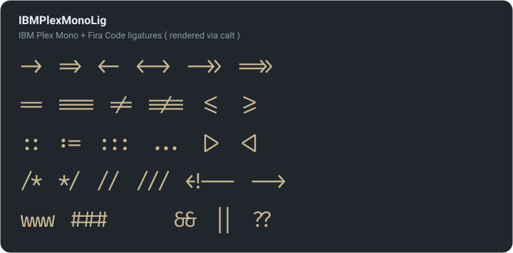

# Blex — IBM Plex Mono + ligatures + Nerd Font

[IBM Plex Mono](https://fonts.google.com/specimen/IBM+Plex+Mono) with [Fira Code programming](https://github.com/tonsky/FiraCode) ligatures copied in, then [NerdFont patched](https://github.com/ryanoasis/nerd-fonts) — a reproducible three-stage build.

> [!TIP]
> - download the sources from google fonts: [IBM Plex Mono](https://fonts.google.com/specimen/IBM+Plex+Mono)
> - official github repo: [IBM/plex](https://github.com/IBM/plex) | [plex-mono-variable](https://github.com/IBM/plex/tree/master/packages/plex-mono-variable)
> - full from-scratch walkthrough: [Blex Ligature Runbook](https://claude.ai/code/artifact/c9643ca9-6da4-43d1-9404-4b6cced40058)



---

<!-- START doctoc generated TOC please keep comment here to allow auto update -->
<!-- DON'T EDIT THIS SECTION, INSTEAD RE-RUN doctoc TO UPDATE -->

- [pipeline](#pipeline)
- [weights](#weights)
  - [regenerate Book](#regenerate-book)
- [build](#build)
- [how it works](#how-it-works)
- [naming &amp; license](#naming-amp-license)

<!-- END doctoc generated TOC please keep comment here to allow auto update -->

---

## pipeline

```bash
#  ┌─────────── Blex/build.sh ( stages 0–2 ) ───────────┐   ┌── build.sh --blex ( stage 3 ) ──┐
IBMPlexMono/*.otf + Book(350)  ──[ ligaturize.sh ]──▶  IBMPlexMonoLig/  ──[ font-patcher + blex-fixnames.py ]──▶  IBMPlexMonoLigNF/
# vendor + Book ( blex-book.sh )    + Fira Code + calt      ligatures        + Nerd Font glyphs ( otf-only, Book kept distinct )
```

```bash
Blex/
├── IBMPlexMono/        # vendor sources ( verbatim copy ) — IBMPlexMono-*.otf ( CFF ) ( + instanced IBMPlexMono-Book{,Italic}.otf )
├── IBMPlexMonoVar/     # stage-0 inputs — IBM Plex Mono variable fonts ( wght axis ), used only to instance Book
├── IBMPlexMonoLig/     # stage-2 output — Fira Code ligatures added ( family: IBMPlexMonoLig )
├── IBMPlexMonoLigNF/   # stage-3 output — NF patched; files are BlexMonoLigNerdFontMono-* ( see naming below )
├── build.sh            # stages 0–2 driver — Book + ligaturize -> IBMPlexMonoLig/ ( repo-root build.sh does stage 3 )
├── blex-book.sh        # stage 0 — instance the Book ( 350 ) weight ( wraps blex-book.py )
├── blex-book.py        # fontTools instancer @ wght=350 + FontForge glyf→CFF
├── blex-fixnames.py    # stage-3 helper — canonical name/filename by usWeightClass ( keeps Book distinct )
└── preview.py          # renders assets/ligatures.svg
```

> [!NOTE]
> `ligaturize.sh` lives at the **repo root** ( shared with the Lekton build ); callers pass `--name IBMPlexMonoLig` explicitly.

> [!NOTE]
> `IBMPlexMono/` is a verbatim copy of the `complete/otf/` fonts from [`@ibm/plex-mono@2.5.0`](https://github.com/IBM/plex/releases/tag/%40ibm%2Fplex-mono%402.5.0) ( released 2026-06-11 ); `IBMPlexMonoVar/` are the matching variable fonts from the same release. Nothing here is hand-edited — to update, re-copy from a newer release, then re-run `blex-book.sh`.

## weights

| WEIGHT     | usWeightClass | SOURCE                                                         |
| ---------- | ------------: | -------------------------------------------------------------- |
| Thin       |           100 | vendor                                                         |
| ExtraLight |           200 | vendor                                                         |
| Light      |           300 | vendor                                                         |
| **Book**   |       **350** | **instanced — `blex-book.sh` @ wght=350 ( upright + Italic )** |
| Regular    |           400 | vendor                                                         |
| Text       |           450 | vendor                                                         |
| Medium     |           500 | vendor                                                         |
| SemiBold   |           600 | vendor                                                         |
| Bold       |           700 | vendor                                                         |

Book ships both `Book` and `Book Italic`, matching the vendor faces. Vendor faces are CFF/OpenType ( `.otf` ); Book is instanced ( glyf ) then converted to CFF, so the whole set stays OTF. ( `Text` 450 is IBM's own in-between weight, distinct from Book 350. )

> [!NOTE]
> Light ( 300 ) is a touch thin and Regular ( 400 ) a touch heavy — **Book ( 350 )** sits exactly between them. It is instanced from IBM Plex Mono's official **variable font** at `wght=350` ( no glyph editing — the font's own deltas interpolate a true 350 ), then flattened to a static face any terminal/editor can select. Its stem measures 60 units, exactly between Light ( 50 ) and Regular ( 70 ).

### regenerate Book

> [!NOTE]
> only when IBM Plex Mono is updated

`IBMPlexMono-Book.otf` and `IBMPlexMono-BookItalic.otf` are committed, so a normal checkout needs nothing. Re-run only after a vendor refresh:

```bash
bash Blex/blex-book.sh                 # instance wght=350 -> IBMPlexMono/IBMPlexMono-Book{,Italic}.otf
bash Blex/blex-book.sh --weight 340    # a touch lighter
```

`blex-book.sh` reads the variable fonts from `IBMPlexMonoVar/` ( fetching them from [IBM/plex](https://github.com/IBM/plex/tree/master/packages/plex-mono-variable) if absent ), instances wght=350 with fonttools, then converts glyf→CFF via FontForge ( quadratic→cubic is exact ). Re-run stages 2–3 ( or `bash build.sh --blex` ) so both Book faces flow through the ligature + Nerd Font steps like every other face.

## build

```bash
# from the repo root ( fonts/ ) — one command does every stage
bash build.sh --blex
```

Or run the two halves by hand:

```bash
# stages 0–2 — ( re )instance Book + ligaturize every face -> IBMPlexMonoLig/
bash Blex/build.sh        # calls blex-book.sh, then repo-root ligaturize.sh --name IBMPlexMonoLig

# stage 3 — Nerd Font patch IBMPlexMonoLig/ -> IBMPlexMonoLigNF/ ( otf-only, via blex-fixnames.py )
bash build.sh --blex
```

> [!IMPORTANT]
> Needs **FontForge's python** ( `brew install fontforge` ), **fonttools** ( for `blex-book.py` ), and, for the NF step, `font-patcher`. The shared repo-root `ligaturize.sh` clones [Ligaturizer](https://github.com/ToxicFrog/Ligaturizer) to `/opt/Ligaturizer` on first run and `reset --hard`s it to the latest on later runs.

## how it works

Ligaturizer copies Fira Code's ligature glyphs and its `calt` rules into each face, scale-corrected to Plex's cell.<br>
`calt` never merges characters — each ligature is drawn as single-cell pieces ( `CR.n.0` … + `lig.n` ) that `calt` swaps in, so the advance width never changes and the font stays monospace.<br>
136 ligatures are copied.

```bash
fontforge -script Blex/preview.py     # regenerate assets/ligatures.svg ( needs hb-shape )
```

> [!NOTE]
> **Italic ligatures are upright.** Fira Code has no italic, so every face gets the same upright ligature glyphs — in italic code the letters slant but `->` / `==` stay vertical. ( The `lig.*` glyphs are byte-identical across Regular and Italic. )

## naming &amp; license

IBM Plex is under the SIL Open Font License 1.1 with **Reserved Font Name “Plex”**, so a modified font may not carry that name.

> [!CAUTION]
> font-patcher renames `IBM Plex` → `Blex` on output automatically. The stage-3 files are `BlexMonoLigNerdFontMono-*.otf` ( CFF, RFN-safe — the vendor is OTF so the build ships OTF only ). Keep `IBMPlexMonoLig/` local; ship the `Blex…` Nerd Font faces.

> [!NOTE]
> font-patcher names output by `usWeightClass` and folds the non-standard **Book ( 350 )** onto Regular ( so it would collide with the real Regular and be lost ), and it can leak ligaturize's abbreviated weights ( `ExtLt` / `Medm` / `SmBld` ) into some italic families. `blex-fixnames.py` runs after each patch and restamps the name table + filename purely from `usWeightClass` + the italic bit — keeping Book a distinct `BlexMonoLigNerdFontMono-Book.otf` and every face canonically named. This is why stage 3 patches each face into its own temp dir.

- Output fonts are **OFL 1.1** ( IBM Plex OFL + Fira Code OFL ).
- Ligaturizer's *script* is GPL-3.0 — used as an external tool; the fonts it produces are not GPL.
- Ligatures via [Fira Code](https://github.com/tonsky/FiraCode) · [Ligaturizer](https://github.com/ToxicFrog/Ligaturizer) · Nerd Font glyphs via [Nerd Fonts](https://github.com/ryanoasis/nerd-fonts).
