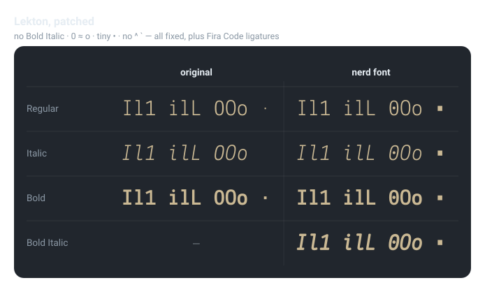

<!-- START doctoc generated TOC please keep comment here to allow auto update -->
<!-- DON'T EDIT THIS SECTION, INSTEAD RE-RUN doctoc TO UPDATE -->

- [features](#features)
- [synthesized Bold Italic](#synthesized-bold-italic)
- [glyph tweaks ( dotted `0`, bigger `•` )](#glyph-tweaks--dotted-0-bigger-%E2%80%A2-)
  - [build ( recommended )](#build--recommended-)
  - [standalone ( dotzero.py )](#standalone--dotzeropy-)

<!-- END doctoc generated TOC please keep comment here to allow auto update -->


> [!TIP]
> - [official download](https://fonts.google.com/specimen/Lekton)




## features

| # | FEATURE                   | WHY                                                                                                                          | EXAMPLE                                                                                                             |
| - | ------------------------- | ---------------------------------------------------------------------------------------------------------------------------- | ------------------------------------------------------------------------------------------------------------------- |
| 1 | **Bold Italic**           | Lekton ships Regular / Bold / Italic but no Bold Italic — synthesized from the Italic ( shapes ) + Bold ( weight )           | –                                                                                                                   |
| 2 | **dotted `0`**            | Lekton's `0` and `o` look nearly identical; a centered dot disambiguates them                                                |  |
| 3 | **bigger `•` ( U+2022 )** | Lekton's bullet is a tiny 58-unit square ( ≈5.8% of em ); scaled up to ~200 ( 20% of em ), keeping its original square shape | –                                                                                                                   |


## preview graphics

`assets/preview.svg` ( the matrix above ) and `assets/zero.svg` ( in the features table ) are rendered from the built fonts by [`preview.py`](preview.py) — glyph outlines, so GitHub's `` shows them without the font installed. Regenerate after a rebuild ( this repo uses the 2-column `fonts-lekton` layout ):

```bash
fontforge -script preview.py --preset fonts-lekton
```

## synthesized Bold Italic

> [!NOTE]
> Lekton ships **Regular / Bold / Italic** but no **Bold Italic**.<br>
> [`bolditalic.py`](bolditalic.py) fills the gap: italic letterforms + slant come from `Lekton-Italic`, weight is borrowed from `Lekton-Bold` — it emboldens the Italic by the auto-measured `Bold − Italic` stem delta ( ≈ 51 at em=1000, `l` stem 52 → 102 vs Bold 103 ), keeps the `-9.3°` slant and per-glyph advance widths ( monospace-safe ), and stamps the RIBBI Bold+Italic name/style bits.

```bash
# from Lekton/ — writes Lekton-BoldItalic.ttf next to the other sources
fontforge -script bolditalic.py
fontforge -script bolditalic.py -n            # preview ( prints the auto amount )
fontforge -script bolditalic.py -a 55         # override embolden units
```

| OPTION           | DEFAULT                       | DESCRIPTION                      |
| ---------------- | ----------------------------- | -------------------------------- |
| `--italic FILE`  | `Lekton-Italic.ttf`           | source italic ( shapes + slant ) |
| `--bold FILE`    | `Lekton-Bold.ttf`             | weight reference ( stem target ) |
| `-o, --out FILE` | `Lekton-BoldItalic.ttf`       | output path                      |
| `-a, --amount N` | auto ( `bold − italic` stem ) | embolden units at em=1000        |
| `-n, --dry-run`  | —                             | print actions without writing    |

> [!NOTE]
> This is a **synthetic** ( faux ) bold, not an original designed weight — good enough for a monospace coding font at editor sizes. Once `Lekton-BoldItalic.ttf` exists, `build.sh --lekton` patches it into a NF face automatically ( `patchMono` globs every non-NerdFont source under `Lekton/` ), then dots `0` + enlarges `•` ( U+2022 ).

## glyph tweaks ( dotted `0`, bigger `•` )

[`dotzero.py`](../dotzero.py) post-processes the built Nerd Font faces in place — advance width is kept ( monospace-safe ) and the source `Lekton-*.ttf` are never touched.

- **dotted `0`** — Lekton's `0` and `o` look nearly identical; a centered dot is added to `0` so the two are easy to tell apart.
- **bigger `•`** — Lekton's bullet ( `•`, U+2022 ) is a tiny 58-unit square ( ≈5.8% of em, even smaller than the middot `·` ). `--square` scales the original outline up ( keeping the square shape; default half-size 100 → 200 wide ); `--bullet` instead replaces it with a round dot ( radius 100 → ⌀200 ). Both create the glyph on faces that lack it.

> [!IMPORTANT]
> Needs FontForge's python. Run via `fontforge -script`, not plain `python3`:
> ```bash
> # macOS
> brew install fontforge
> # ubuntu
> sudo apt install fontforge
> ```

### build ( recommended )

`build.sh --lekton` patches Lekton to Nerd Font Mono, then dots the `0` and enlarges the `•` in place:

```bash
# from the repo root ( fonts/ )
bash build.sh --lekton              # build NF ( otf + ttf ) + dot 0 + enlarge •
bash build.sh --lekton --dry-run    # preview the commands only
```

`--all-mono` / `--all` include this step automatically.

### standalone ( dotzero.py )

```bash
# dot the 0 on every already-built NerdFont face in place
fontforge -script dotzero.py -o Lekton Lekton/*NerdFont*.otf

# dot the 0 and enlarge the • as a square ( default half-size 100 = 200 wide = 20% of em )
fontforge -script dotzero.py --square -o Lekton Lekton/*NerdFont*.otf Lekton/*NerdFont*.ttf

# round dot instead of the square ( mutually exclusive with --square )
fontforge -script dotzero.py --bullet -o Lekton Lekton/*NerdFont*.otf
```

| OPTION              | DEFAULT                    | DESCRIPTION                                                                                |
| ------------------- | -------------------------- | ------------------------------------------------------------------------------------------ |
| `-o, --out-dir DIR` | `<input-parent>/nf-dotted` | output dir                                                                                 |
| `-r, --radius N`    | `62`                       | dot radius at em=1000                                                                      |
| `--bold-radius N`   | `radius + 10`              | dot radius for bold faces ( auto-detected )                                                |
| `-g, --glyph NAME`  | `zero`                     | glyph to dot                                                                               |
| `--square [N]`      | off ( `100` when passed )  | enlarge `•` keeping its square shape ( half-size N → `100` = 200 wide = 20% em )           |
| `--bullet [N]`      | off ( `100` when passed )  | enlarge `•` as a round dot ( radius N → `100` = ⌀200 ); mutually exclusive with `--square` |
| `--rename SUFFIX`   | —                          | append SUFFIX to family name, e.g. `' Dotted'`, to coexist with the original               |
| `-n, --dry-run`     | —                          | print actions without writing                                                              |

```bash
# smaller dot, keep as a separate family so both can be installed
fontforge -script dotzero.py -r 50 --rename ' Dotted' -o Lekton Lekton/*NerdFont*.otf
```

- inputs may be files or directories ( scans `*.otf` / `*.ttf` )
- both radii auto-scale when `em != 1000`; the dot uses `--bold-radius` on bold faces, the bullet keeps one radius across weights

> [!WARNING]
> Re-running on an already-processed face adds a **second** dot to `0` ( it prints a `warn` and proceeds ). Dot from freshly built NF faces, or just use `build.sh --lekton` ( which rebuilds clean faces first ).
