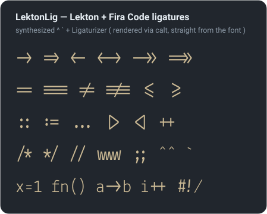

<!-- START doctoc generated TOC please keep comment here to allow auto update -->
<!-- DON'T EDIT THIS SECTION, INSTEAD RE-RUN doctoc TO UPDATE -->
<!-- END doctoc generated TOC please keep comment here to allow auto update -->

- [features](#features)
- [layout](#layout)
- [build](#build)
- [install](#install)
- [how it works](#how-it-works)
  - [synthesized Bold Italic](#synthesized-bold-italic)
  - [glyph tweaks — dotted `0`, bigger `•`, added `^` `` ` ``](#glyph-tweaks--dotted-0-bigger-%E2%80%A2-added-%5E---)
  - [ligatures](#ligatures)
- [preview graphics](#preview-graphics)
- [license & credits](#license--credits)

<!-- END doctoc generated TOC please keep comment here to allow auto update -->


> [!TIP]
> - [official download](https://fonts.google.com/specimen/Lekton)


Modified [Lekton](https://fonts.google.com/specimen/Lekton) with five fixes plus [Fira Code](https://github.com/tonsky/FiraCode) programming ligatures — part of the `fonts` collection, so one `build.sh` run produces it alongside every other font.

## features

| # | FEATURE                   | WHY                                                                                                                                             | EXAMPLE                                                                                                             |
| - | ------------------------- | ----------------------------------------------------------------------------------------------------------------------------------------------- | ------------------------------------------------------------------------------------------------------------------- |
| 1 | **Bold Italic**           | Lekton ships Regular / Bold / Italic but no Bold Italic — synthesized from the Italic ( shapes ) + Bold ( weight )                              | –                                                                                                                   |
| 2 | **dotted `0`**            | Lekton's `0` and `o` look nearly identical; a centered dot disambiguates them                                                                   |  |
| 3 | **bigger `•` ( U+2022 )** | Lekton's bullet is a tiny 58-unit square ( ≈5.8% of em ); scaled up to ~200 ( 20% of em ), keeping its original square shape                    | –                                                                                                                   |
| 4 | **added `^` `` ` ``**     | Lekton ships without `^` ( asciicircum ) and `` ` `` ( grave ); synthesized from the face's own **â / à** accents so they match Lekton's stroke | –                                                                                                                   |
| 5 | **ligatures**             | [Fira Code](https://github.com/tonsky/FiraCode) programming ligatures copied in via `calt` ( monospace-safe )                                   | see [below](#ligatures)                                                                                             |

## layout

```bash
Lekton-{Regular,Bold,Italic}.ttf
  └─[ Lekton/build.sh ]─ Bold Italic + dotted 0 + • + ^ ` + Fira Code ligatures ─▶ LektonLig/
      └─[ font-patcher ]─ + Nerd Font glyphs ─▶ LektonLigNF/
```

| DIR / FILE                                                    | CONTENTS                                                                        |
| ------------------------------------------------------------- | ------------------------------------------------------------------------------- |
| `Lekton-{Regular,Bold,Italic}.ttf`                            | vendor sources ( untouched )                                                    |
| [`LektonLig/`](./LektonLig)                                   | 4 desktop faces — Regular / Bold / Italic / **Bold Italic**, all fixes + ligatures |
| [`LektonLigNF/`](./LektonLigNF)                               | 4 Nerd Font Mono faces ( `otf` + `ttf` ) — LektonLig + NF glyph set             |
| [`build.sh`](./build.sh)                                      | builds `LektonLig/` ( Bold Italic + fixes + ligatures )                         |
| `bolditalic.py` · `dotzero.py` · `glyphfix.py` · `preview.py` | the FontForge scripts                                                           |

Lekton declares no OFL Reserved Font Name, so the ligature build keeps the Lekton letterforms as **LektonLig** / **LektonLigNerdFontMono**. There is no plain ( non-ligature ) Nerd Font here — the collection's ligature-free mono role is filled by other families.

## build

```bash
# from the repo root ( fonts/ ) — build LektonLig/ + LektonLigNF/
bash build.sh --lekton
bash build.sh --lekton --dry-run    # preview the commands only
```

> [!TIP]
> `--all-mono` / `--all` include Lekton automatically. The intermediate *optimized* faces ( Bold Italic + fixes, pre-ligature ) live in a temp dir; only `LektonLig/` and `LektonLigNF/` are kept.

`build.sh --lekton` runs [`Lekton/build.sh`](./build.sh) ( Bold Italic → dotted 0 → `•` + `^` `` ` `` → ligatures → `LektonLig/` ), then Nerd-Font-patches `LektonLig/` into `LektonLigNF/`.

> [!IMPORTANT]
> Requires FontForge ( `brew install fontforge` ) and `font-patcher` at `/opt/FontPatcher/font-patcher`. The ligature step uses the repo-root [`ligaturize.sh`](../ligaturize.sh), which clones [Ligaturizer](https://github.com/ToxicFrog/Ligaturizer) to `/opt/Ligaturizer` on first run. `hb-shape` ( `brew install harfbuzz` ) is needed only to regenerate `assets/ligatures.svg`.

## install

- **editor / desktop** → the four faces in [`LektonLig/`](./LektonLig).
- **terminal / prompt with glyphs** → the four faces in [`LektonLigNF/`](./LektonLigNF) ( use the `ttf` unless your terminal prefers `otf` ).

macOS: double-click a font, or drop the files into `~/Library/Fonts`. Linux: copy into `~/.local/share/fonts` then `fc-cache -f`.

> [!NOTE]
> Enable **contextual alternates** ( `calt` ) in your editor to see the ligatures — most editors and terminals keep it on by default.

## how it works

Each step below runs on the *optimized* base faces in a temp dir ( inside `Lekton/build.sh` ) before the ligature + Nerd Font passes; advance width is kept throughout ( monospace-safe ) and the vendor `Lekton-*.ttf` are never modified.

### synthesized Bold Italic

> [!NOTE]
> Lekton ships **Regular / Bold / Italic** but no **Bold Italic**.<br>
> [`bolditalic.py`](bolditalic.py) fills the gap: italic letterforms + slant come from `Lekton-Italic`, weight is borrowed from `Lekton-Bold` — it emboldens the Italic by the auto-measured `Bold − Italic` stem delta ( ≈ 51 at em=1000, `l` stem 52 → 102 vs Bold 103 ), keeps the `-9.3°` slant and per-glyph advance widths, and stamps the RIBBI Bold+Italic name/style bits. Synthetic ( faux ) bold — good enough for a coding font at editor sizes.

```bash
fontforge -script bolditalic.py --italic Lekton-Italic.ttf --bold Lekton-Bold.ttf -o Lekton-BoldItalic.ttf
fontforge -script bolditalic.py -n            # dry-run ( prints the auto amount )
```

| OPTION           | DEFAULT                       | DESCRIPTION                      |
| ---------------- | ----------------------------- | -------------------------------- |
| `--italic FILE`  | `Lekton-Italic.ttf`           | source italic ( shapes + slant ) |
| `--bold FILE`    | `Lekton-Bold.ttf`             | weight reference ( stem target ) |
| `-o, --out FILE` | `Lekton-BoldItalic.ttf`       | output path                      |
| `-a, --amount N` | auto ( `bold − italic` stem ) | embolden units at em=1000        |
| `-n, --dry-run`  | —                             | print actions without writing    |

### glyph tweaks — dotted `0`, bigger `•`, added `^` `` ` ``

[`dotzero.py`](./dotzero.py) dots the `0`; [`glyphfix.py`](./glyphfix.py) enlarges the `•` and synthesizes the missing `^` / `` ` `` from the top contour of the face's own `â` / `à` accent ( matching Lekton's stroke ). Both create the glyph on faces that lack it, and glyphfix's `^` is also what lets Ligaturizer run ( it aborts on a font without `^` ).

```bash
fontforge -script dotzero.py  -o OUT path/to/*.ttf                     # dot the 0
fontforge -script glyphfix.py --square -o OUT path/to/*.ttf            # square • ( default ) + ^ `
fontforge -script glyphfix.py --bullet   -o OUT path/to/*.ttf          # round • instead
fontforge -script glyphfix.py --no-ascii -o OUT path/to/*.ttf          # only touch the •
```

| SCRIPT / OPTION           | DEFAULT                    | DESCRIPTION                                                                                |
| ------------------------- | -------------------------- | ------------------------------------------------------------------------------------------ |
| `dotzero.py -r, --radius` | `62`                       | dot radius at em=1000 ( `--bold-radius` on bold faces )                                     |
| `dotzero.py -g, --glyph`  | `zero`                     | glyph to dot                                                                               |
| `glyphfix.py --square [N]`| on ( `100` by default )    | enlarge `•` keeping its square shape ( half-size N → `100` = 200 wide = 20% em )           |
| `glyphfix.py --bullet [N]`| off ( `100` when passed )  | enlarge `•` as a round dot ( radius N → `100` = ⌀200 ); mutually exclusive with `--square` |
| `glyphfix.py --no-ascii`  | —                          | skip adding `^` / `` ` ``                                                                   |
| `-o, --out-dir DIR`       | `<input-parent>-{dotted,glyphfix}` | output dir                                                                        |
| `--rename SUFFIX`         | —                          | append SUFFIX to the family name                                                           |
| `-n, --dry-run`           | —                          | print actions without writing                                                              |

> [!WARNING]
> Re-running `dotzero.py` on an already-dotted face adds a **second** dot to `0` ( it prints a `warn` and proceeds ). `build.sh --lekton` always dots freshly built faces, so this never happens in the normal flow.

### ligatures

The repo-root [`ligaturize.sh`](../ligaturize.sh) wraps [Ligaturizer](https://github.com/ToxicFrog/Ligaturizer): it copies Fira Code's ligature glyphs and its `calt` rules into every optimized face, scale-corrected to Lekton's cell, and renames the family to `LektonLig` ( `--name`, defaulting to the `--to` dir ). `calt` never merges characters — each ligature is drawn as single-cell pieces that `calt` swaps in, so the advance width never changes and the font stays monospace.



> [!NOTE]
> **Italic ligatures are upright.** Fira Code has no italic, so every face gets the same upright ligature glyphs — in italic code the letters slant but `->` / `==` stay vertical.

## preview graphics

`assets/preview.svg` ( the matrix above ), `assets/zero.svg` ( in the features table ), and `assets/ligatures.svg` are rendered from the built fonts by [`preview.py`](preview.py) — glyph outlines, so GitHub's `` shows them without the font installed. Ligature samples are shaped with `hb-shape` first ( `calt` applied ). Regenerate after a rebuild ( this repo uses the 2-column `fonts-lekton` layout ):

```bash
fontforge -script preview.py --preset fonts-lekton
```

## license & credits

- **Lekton** © Accademia di Belle Arti di Urbino — [SIL Open Font License 1.1](../LICENSE) ( no Reserved Font Name ).
- Modifications ( Bold Italic, dotted `0`, bigger `•`, added `^` `` ` ``, ligature + Nerd Font patching ) by marslo, released under the same OFL 1.1.
- Ligatures via [Fira Code](https://github.com/tonsky/FiraCode) ( OFL 1.1 ) · [Ligaturizer](https://github.com/ToxicFrog/Ligaturizer) ( script GPL-3.0, used as an external tool — the fonts it produces are not GPL ).
- Nerd Font glyphs via [Nerd Fonts](https://github.com/ryanoasis/nerd-fonts).
