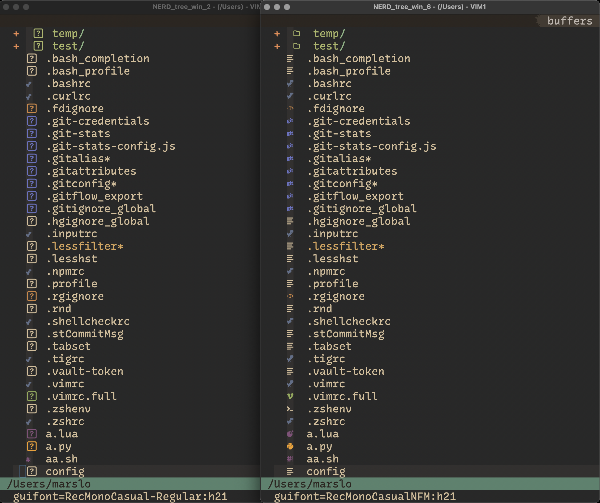

<h1>!! The project is only for learning records, NOT for any commercial use !!</h1>

<!-- START doctoc generated TOC please keep comment here to allow auto update -->
<!-- DON'T EDIT THIS SECTION, INSTEAD RE-RUN doctoc TO UPDATE -->

- [Nerd Fonts for DevIcons](#nerd-fonts-for-devicons)
- [install patched fonts](#install-patched-fonts)
  - [Operator](#operator)
    - [OperatorMono Nerd Font Mono](#operatormono-nerd-font-mono)
    - [OperatorMonoLig Nerd Font Mono](#operatormonolig-nerd-font-mono)
    - [OperatorMonoSSmLig Nerd Font Mono](#operatormonossmlig-nerd-font-mono)
    - [Operator Pro Nerd Font](#operator-pro-nerd-font)
  - [Recursive](#recursive)
    - [RecMonoCasual Nerd Font Mono](#recmonocasual-nerd-font-mono)
    - [RecMonoLinear Nerd Font Mono](#recmonolinear-nerd-font-mono)
    - [RecMonoSmCasual Nerd Font Mono](#recmonosmcasual-nerd-font-mono)
    - [RecMonoDuotone Nerd Font Mono](#recmonoduotone-nerd-font-mono)
    - [Recursive Sans Casual Static Nerd Font](#recursive-sans-casual-static-nerd-font)
    - [Recursive Sans Linear Static Nerd Font](#recursive-sans-linear-static-nerd-font)
  - [Monaco Nerd Font Mono](#monaco-nerd-font-mono)
    - [Monaco Nerd Font Mono](#monaco-nerd-font-mono-1)
    - [MonacoLigaturized Nerd Font Mono](#monacoligaturized-nerd-font-mono)
  - [VictorMono Nerd Font Mono](#victormono-nerd-font-mono)
  - [ComicMono Nerd Font Mono](#comicmono-nerd-font-mono)
  - [Monofur Nerd Font Mono](#monofur-nerd-font-mono)
  - [Menlo Nerd Font Mono](#menlo-nerd-font-mono)
- [tips](#tips)

<!-- END doctoc generated TOC please keep comment here to allow auto update -->

# Nerd Fonts for DevIcons



# install patched fonts

> TIPS:
> - `fontsPath`:
>   - `osx`: `~/Library/Fonts`
>   - `linux`: `~/.local/share/fonts`

## Operator
### OperatorMono Nerd Font Mono

> TIPS:<p>
> support both `otf` and `ttf`

```bash
$ curl --create-dirs -O --output-dir "${fontsPath}" \
       -fsSL --remote-name-all \
       https://github.com/marslo/fonts/raw/fonts/Operator/OperatorMonoNF/otf/OperatorMonoNerdFontMono-Light.otf \
       https://github.com/marslo/fonts/raw/fonts/Operator/OperatorMonoNF/otf/OperatorMonoNerdFontMono-LightItalic.otf
```


### OperatorMonoLig Nerd Font Mono

> TIPS:<p>
> support both `otf` and `ttf`

```bash
$ curl --create-dirs -O --output-dir "${fontsPath}" \
       -fsSL --remote-name-all \
       https://github.com/marslo/fonts/raw/fonts/Operator/OperatorMonoLigNF/otf/OperatorMonoLigNerdFontMono-Light.otf \
       https://github.com/marslo/fonts/raw/fonts/Operator/OperatorMonoLigNF/otf/OperatorMonoLigNerdFontMono-LightItalic.otf
```


### OperatorMonoSSmLig Nerd Font Mono

> TIPS:<p>
> support both `otf` and `ttf`

```bash
$ curl --create-dirs -O --output-dir "${fontsPath}" \
       -fsSL --remote-name-all \
       https://github.com/marslo/fonts/raw/fonts/Operator/OperatorMonoSSmLigNF/otf/OperatorMonoSSmLigNerdFontMono-Regular.otf \
       https://github.com/marslo/fonts/raw/fonts/Operator/OperatorMonoSSmLigNF/otf/OperatorMonoSSmLigNerdFontMono-Italic.otf  \
       https://github.com/marslo/fonts/raw/fonts/Operator/OperatorMonoSSmLigNF/otf/OperatorMonoSSmLigNerdFontMono-Light.otf   \
       https://github.com/marslo/fonts/raw/fonts/Operator/OperatorMonoSSmLigNF/otf/OperatorMonoSSmLigNerdFontMono-LightItalic.otf
```


### Operator Pro Nerd Font

> TIPS:<p>
> - `OperatorPro-Book` -> `OperatorProNerdFont-Regular`
> - `OperatorPro-BookItalic` -> `OperatorProNerdFont-Italic`

```bash
$ ext='otf'             # or ext='ttf'
$ curl --create-dirs -O --output-dir "${fontsPath}" \
       -fsSL --remote-name-all \
       https://github.com/marslo/fonts/raw/fonts/Operator/OperatorProNF/OperatorProNerdFont-Regular.otf \
       https://github.com/marslo/fonts/raw/fonts/Operator/OperatorProNF/OperatorProNerdFont-Italic.otf  \
       https://github.com/marslo/fonts/raw/fonts/Operator/OperatorProNF/OperatorProNerdFont-Light.otf   \
       https://github.com/marslo/fonts/raw/fonts/Operator/OperatorProNF/OperatorProNerdFont-LightItalic.otf
```

## [Recursive](https://github.com/arrowtype/recursive)

> TIPS:<p>
> support both `otf` and `ttf`

### RecMonoCasual Nerd Font Mono
```bash
$ curl --create-dirs -O --output-dir "${fontsPath}" \
       -fsSL --remote-name-all \
       https://github.com/marslo/fonts/raw/fonts/Recursive/Recursive_Code_NF/RecMonoCasual/RecMonoCasualNerdFontMono-Regular.otf \
       https://github.com/marslo/fonts/raw/fonts/Recursive/Recursive_Code_NF/RecMonoCasual/RecMonoCasualNerdFontMono-Italic.otf  \
       https://github.com/marslo/fonts/raw/fonts/Recursive/Recursive_Code_NF/RecMonoCasual/RecMonoCasualNerdFontMono-Bold.otf    \
       https://github.com/marslo/fonts/raw/fonts/Recursive/Recursive_Code_NF/RecMonoCasual/RecMonoCasualNerdFontMono-BoldItalic.otf
```

### RecMonoLinear Nerd Font Mono
```bash
$ curl --create-dirs -O --output-dir "${fontsPath}" \
       -fsSL --remote-name-all \
       https://github.com/marslo/fonts/raw/fonts/Recursive/Recursive_Code_NF/RecMonoLinear/RecMonoLinearNerdFontMono-Regular.otf \
       https://github.com/marslo/fonts/raw/fonts/Recursive/Recursive_Code_NF/RecMonoLinear/RecMonoLinearNerdFontMono-Italic.otf  \
       https://github.com/marslo/fonts/raw/fonts/Recursive/Recursive_Code_NF/RecMonoLinear/RecMonoLinearNerdFontMono-Bold.otf    \
       https://github.com/marslo/fonts/raw/fonts/Recursive/Recursive_Code_NF/RecMonoLinear/RecMonoLinearNerdFontMono-BoldItalic.otf
```

### RecMonoSmCasual Nerd Font Mono
```bash
$ curl --create-dirs -O --output-dir "${fontsPath}" \
       -fsSL --remote-name-all \
       https://github.com/marslo/fonts/raw/fonts/Recursive/Recursive_Code_NF/RecMonoSemicasual/RecMonoSmCasualNerdFontMono-Regular.otf \
       https://github.com/marslo/fonts/raw/fonts/Recursive/Recursive_Code_NF/RecMonoSemicasual/RecMonoSmCasualNerdFontMono-Italic.otf  \
       https://github.com/marslo/fonts/raw/fonts/Recursive/Recursive_Code_NF/RecMonoSemicasual/RecMonoSmCasualNerdFontMono-Bold.otf    \
       https://github.com/marslo/fonts/raw/fonts/Recursive/Recursive_Code_NF/RecMonoSemicasual/RecMonoSmCasualNerdFontMono-BoldItalic.otf
```

### RecMonoDuotone Nerd Font Mono
```bash
$ curl --create-dirs -O --output-dir "${fontsPath}" \
       -fsSL --remote-name-all \
       https://github.com/marslo/fonts/raw/fonts/Recursive/Recursive_Code_NF/RecMonoDuotone/RecMonoDuotoneNerdFontMono-Regular.otf \
       https://github.com/marslo/fonts/raw/fonts/Recursive/Recursive_Code_NF/RecMonoDuotone/RecMonoDuotoneNerdFontMono-Italic.otf  \
       https://github.com/marslo/fonts/raw/fonts/Recursive/Recursive_Code_NF/RecMonoDuotone/RecMonoDuotoneNerdFontMono-Bold.otf    \
       https://github.com/marslo/fonts/raw/fonts/Recursive/Recursive_Code_NF/RecMonoDuotone/RecMonoDuotoneNerdFontMono-BoldItalic.otf
```


### Recursive Sans Casual Static Nerd Font
```bash
$ curl --create-dirs -O --output-dir "${fontsPath}" \
       -fsSL --remote-name-all \
       https://github.com/marslo/fonts/raw/fonts/Recursive/Recursive_Desktop_NF/otf/RecursiveSansCasualStaticNerdFont-Regular.otf \
       https://github.com/marslo/fonts/raw/fonts/Recursive/Recursive_Desktop_NF/otf/RecursiveSansCasualStaticNerdFont-Italic.otf  \
       https://github.com/marslo/fonts/raw/fonts/Recursive/Recursive_Desktop_NF/otf/RecursiveSansCasualStaticNerdFont-Light.otf   \
       https://github.com/marslo/fonts/raw/fonts/Recursive/Recursive_Desktop_NF/otf/RecursiveSansCasualStaticNerdFont-LightItalic.otf

```

### Recursive Sans Linear Static Nerd Font
```bash
$ curl --create-dirs -O --output-dir "${fontsPath}" \
       -fsSL --remote-name-all \
       https://github.com/marslo/fonts/raw/fonts/Recursive/Recursive_Desktop_NF/otf/RecursiveSansLinearStaticNerdFont-Regular.otf \
       https://github.com/marslo/fonts/raw/fonts/Recursive/Recursive_Desktop_NF/otf/RecursiveSansLinearStaticNerdFont-Italic.otf  \
       https://github.com/marslo/fonts/raw/fonts/Recursive/Recursive_Desktop_NF/otf/RecursiveSansLinearStaticNerdFont-Light.otf   \
       https://github.com/marslo/fonts/raw/fonts/Recursive/Recursive_Desktop_NF/otf/RecursiveSansLinearStaticNerdFont-LightItalic.otf
```

## Monaco Nerd Font Mono

> TIPS:<p>
> - support both `otf` and `ttf`
> - MonacoLigaturized not support for iTerm2 ( not sure why )

### Monaco Nerd Font Mono
```bash
$ curl --create-dirs -O --output-dir "${fontsPath}" \
       -fsSL \
       https://github.com/marslo/fonts/raw/fonts/Monaco/MonacoNF/otf/MonacoNerdFontMono-Regular.otf  \
       https://github.com/marslo/fonts/raw/fonts/Monaco/MonacoNF/otf/MonacoNerdFontMono-Italic.otf   \
       https://github.com/marslo/fonts/raw/fonts/Monaco/MonacoNF/otf/MonacoNerdFontMono-Bold.otf     \
       https://github.com/marslo/fonts/raw/fonts/Monaco/MonacoNF/otf/MonacoNerdFontMono-BoldItalic.otf
```

### MonacoLigaturized Nerd Font Mono
```bash
$ curl --create-dirs -O --output-dir "${fontsPath}" \
       -fsSL \
       https://github.com/marslo/fonts/raw/fonts/Monaco/MonacoLigNF/otf/MonacoLigaturizedNerdFontMono-Regular.otf  \
       https://github.com/marslo/fonts/raw/fonts/Monaco/MonacoLigNF/otf/MonacoLigaturizedNerdFontMono-Italic.otf   \
       https://github.com/marslo/fonts/raw/fonts/Monaco/MonacoLigNF/otf/MonacoLigaturizedNerdFontMono-Bold.otf     \
       https://github.com/marslo/fonts/raw/fonts/Monaco/MonacoLigNF/otf/MonacoLigaturizedNerdFontMono-BoldItalic.otf
```


## VictorMono Nerd Font Mono
```bash
$ curl --create-dirs -O --output-dir "${fontsPath}" \
       -fsSL --remote-name-all \
       https://github.com/marslo/fonts/raw/fonts/VictorMono/VictorMono-Light.ttf \
       https://github.com/marslo/fonts/raw/fonts/VictorMono/VictorMono-LightItalic.ttf
```


## ComicMono Nerd Font Mono
```bash
$ curl --create-dirs -O --output-dir "${fontsPath}" \
       -fsSL --remote-name-all \
       https://github.com/marslo/fonts/raw/fonts/ComicMono/ComicMonoNerdFontMono-Regular.otf \
       https://github.com/marslo/fonts/raw/fonts/ComicMono/ComicMonoNerdFontMono-Bold.otf
```


## Monofur Nerd Font Mono
```bash
$ curl --create-dirs -O --output-dir "${fontsPath}" \
       -fsSL --remote-name-all \
       https://github.com/marslo/fonts/raw/fonts/monofur/MonofurNerdFontMono-Regular.ttf \
       https://github.com/marslo/fonts/raw/fonts/monofur/MonofurNerdFontMono-Italic.ttf
```


## Menlo Nerd Font Mono
```bash
$ curl --create-dirs -O --output-dir "${fontsPath}" -fsSL \
       https://github.com/marslo/fonts/raw/fonts/menlo/MenloNerdFontMono-Regular.otf
```


# tips
- list fonts properties
  ```bash
  $ fc-query /path/to/font.ttf
  ```

- [list particular field of fonts properties](https://stackoverflow.com/a/43614521/2940319)
  ```bash
  $ fc-query -f '%{family}\n' /path/to/font.ttf

  # shwo `guifont` value for nvim/vim
  $ fc-query -f '%{family}\n%{postscriptname}' ~/Library/Fonts/OperatorMonoSSmLigNerdFontMono-Light.otf | awk -F, '{print $NF}'
  OperatorMonoSSmLig Nerd Font Mono Light
  OperatorMonoSSmLigNFM-Light
  ```

- list all installed fonts
  ```bash
  $ fc-list | sed -re 's/^.+\/([^:]+):\s?([^,:]+),?:?.*$/\1 : \2/g' | column -t -s: -o: | sort -t: -k2
  ```
