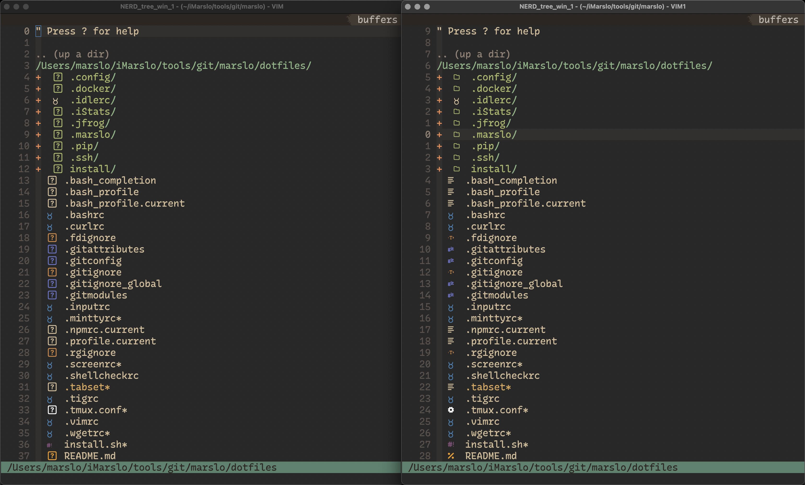
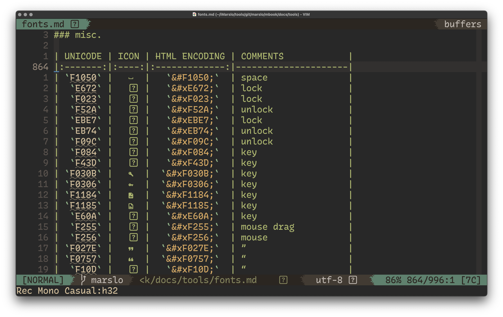
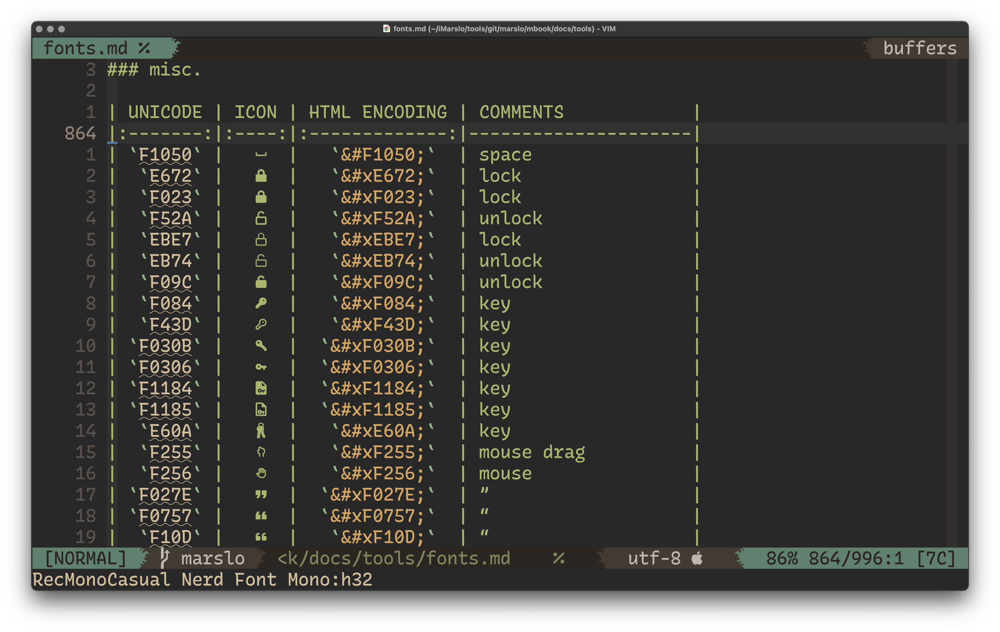

## Nerd Fonts for DevIcons

- devicons:

  

- original font

  

- patched via Nerd Fonts

  


## install patched fonts

> TIPS:
> - `fontsPath`:
>   - `osx`: `~/Library/Fonts`
>   - `linux`: `~/.local/share/fonts`

### Operator
- mono
  ```bash
  $ curl --create-dirs -O --output-dir "${fontsPath}" \
         -fsSL --remote-name-all \
         https://github.com/marslo/fonts/raw/fonts/Operator/OperatorMono/OperatorMono-Light.otf \
         https://github.com/marslo/fonts/raw/fonts/Operator/OperatorMono/OperatorMono-LightItalic.otf
  ```

- mono lig
  ```bash
  $ ext='otf'             # or ext='ttf'
  $ curl --create-dirs -O --output-dir "${fontsPath}" \
         -fsSL --remote-name-all \
         https://github.com/marslo/fonts/raw/fonts/Operator/OperatorMonoLigNF/OperatorMonoLigNerdFontMono-Light."${ext}" \
         https://github.com/marslo/fonts/raw/fonts/Operator/OperatorMonoLigNF/OperatorMonoLigNerdFontMono-LightItalic."${ext}"
  ```

- Pro

  > TIPS
  > - `OperatorPro-Book` -> `OperatorProNerdFont-Regular`
  > - `OperatorPro-BookItalic` -> `OperatorProNerdFont-Italic`

  ```bash
  $ ext='otf'             # or ext='ttf'
  $ curl --create-dirs -O --output-dir "${fontsPath}" \
         -fsSL --remote-name-all \
         https://github.com/marslo/fonts/raw/fonts/Operator/OperatorProNF/OperatorProNerdFont-Regular."${ext}" \
         https://github.com/marslo/fonts/raw/fonts/Operator/OperatorProNF/OperatorProNerdFont-Italic."${ext}" \
         https://github.com/marslo/fonts/raw/fonts/Operator/OperatorProNF/OperatorProNerdFont-Light."${ext}" \
         https://github.com/marslo/fonts/raw/fonts/Operator/OperatorProNF/OperatorProNerdFont-LightItalic."${ext}"
  ```

### Monaco
```bash
$ ext='otf'             # or ext='ttf'
$ curl --create-dirs -O --output-dir "${fontsPath}" \
       -fsSL \
       https://github.com/marslo/fonts/raw/fonts/Monaco/MonacoNerdFontMono-Regular."${ext}"
```

### [Recursive](https://github.com/arrowtype/recursive)
- code

  > support ttf and otf

  ```bash
  # RecMonoCasual
  $ curl --create-dirs -O --output-dir "${fontsPath}" \
         -fsSL --remote-name-all \
         https://github.com/marslo/fonts/raw/fonts/Recursive/Recursive_Code_NF/RecMonoCasual/RecMonoCasualNerdFontMono-Regular.otf \
         https://github.com/marslo/fonts/raw/fonts/Recursive/Recursive_Code_NF/RecMonoCasual/RecMonoCasualNerdFontMono-Italic.otf \
         https://github.com/marslo/fonts/raw/fonts/Recursive/Recursive_Code_NF/RecMonoCasual/RecMonoCasualNerdFontMono-Bold.otf \
         https://github.com/marslo/fonts/raw/fonts/Recursive/Recursive_Code_NF/RecMonoCasual/RecMonoCasualNerdFontMono-BoldItalic.otf

  # RecMonoLinear
  $ curl --create-dirs -O --output-dir "${fontsPath}" \
         -fsSL --remote-name-all \
         https://github.com/marslo/fonts/raw/fonts/Recursive/Recursive_Code_NF/RecMonoLinear/RecMonoLinearNerdFontMono-Regular.otf \
         https://github.com/marslo/fonts/raw/fonts/Recursive/Recursive_Code_NF/RecMonoLinear/RecMonoLinearNerdFontMono-Italic.otf \
         https://github.com/marslo/fonts/raw/fonts/Recursive/Recursive_Code_NF/RecMonoLinear/RecMonoLinearNerdFontMono-Bold.otf \
         https://github.com/marslo/fonts/raw/fonts/Recursive/Recursive_Code_NF/RecMonoLinear/RecMonoLinearNerdFontMono-BoldItalic.otf

  # RecMonoSemicasual
  $ curl --create-dirs -O --output-dir "${fontsPath}" \
         -fsSL --remote-name-all \
         https://github.com/marslo/fonts/raw/fonts/Recursive/Recursive_Code_NF/RecMonoSemicasual/RecMonoSmCasualNerdFontMono-Regular.otf \
         https://github.com/marslo/fonts/raw/fonts/Recursive/Recursive_Code_NF/RecMonoSemicasual/RecMonoSmCasualNerdFontMono-Italic.otf \
         https://github.com/marslo/fonts/raw/fonts/Recursive/Recursive_Code_NF/RecMonoSemicasual/RecMonoSmCasualNerdFontMono-Bold.otf \
         https://github.com/marslo/fonts/raw/fonts/Recursive/Recursive_Code_NF/RecMonoSemicasual/RecMonoSmCasualNerdFontMono-BoldItalic.otf

  # RecMonoDuotone
  $ curl --create-dirs -O --output-dir "${fontsPath}" \
         -fsSL --remote-name-all \
         https://github.com/marslo/fonts/raw/fonts/Recursive/Recursive_Code_NF/RecMonoDuotone/RecMonoDuotoneNerdFontMono-Regular.otf \
         https://github.com/marslo/fonts/raw/fonts/Recursive/Recursive_Code_NF/RecMonoDuotone/RecMonoDuotoneNerdFontMono-Italic.otf \
         https://github.com/marslo/fonts/raw/fonts/Recursive/Recursive_Code_NF/RecMonoDuotone/RecMonoDuotoneNerdFontMono-Bold.otf \
         https://github.com/marslo/fonts/raw/fonts/Recursive/Recursive_Code_NF/RecMonoDuotone/RecMonoDuotoneNerdFontMono-BoldItalic.otf
  ```

- desktop
  ```bash
  $ ext='otf'             # or ext='ttf'

  # RecursiveSansCasualStatic
  $ curl --create-dirs -O --output-dir "${fontsPath}" \
         -fsSL --remote-name-all \
         https://github.com/marslo/fonts/raw/fonts/Recursive/Recursive_Desktop_NF/"${ext}"/RecursiveSansCasualStaticNerdFont-Regular."${ext}" \
         https://github.com/marslo/fonts/raw/fonts/Recursive/Recursive_Desktop_NF/"${ext}"/RecursiveSansCasualStaticNerdFont-Italic."${ext}" \
         https://github.com/marslo/fonts/raw/fonts/Recursive/Recursive_Desktop_NF/"${ext}"/RecursiveSansCasualStaticNerdFont-Light."${ext}" \
         https://github.com/marslo/fonts/raw/fonts/Recursive/Recursive_Desktop_NF/"${ext}"/RecursiveSansCasualStaticNerdFont-LightItalic."${ext}"

  # RecursiveSansLinearStatic
  $ curl --create-dirs -O --output-dir "${fontsPath}" \
         -fsSL --remote-name-all \
         https://github.com/marslo/fonts/raw/fonts/Recursive/Recursive_Desktop_NF/"${ext}"/RecursiveSansLinearStaticNerdFont-Regular."${ext}" \
         https://github.com/marslo/fonts/raw/fonts/Recursive/Recursive_Desktop_NF/"${ext}"/RecursiveSansLinearStaticNerdFont-Italic."${ext}" \
         https://github.com/marslo/fonts/raw/fonts/Recursive/Recursive_Desktop_NF/"${ext}"/RecursiveSansLinearStaticNerdFont-Light."${ext}" \
         https://github.com/marslo/fonts/raw/fonts/Recursive/Recursive_Desktop_NF/"${ext}"/RecursiveSansLinearStaticNerdFont-LightItalic."${ext}"
  ```

### victor mono
```bash
$ curl --create-dirs -O --output-dir "${fontsPath}" \
       -fsSL --remote-name-all \
       https://github.com/marslo/fonts/raw/fonts/VictorMono/VictorMono-Light.ttf \
       https://github.com/marslo/fonts/raw/fonts/VictorMono/VictorMono-LightItalic.ttf
```

## tips
- list fonts properties
  ```bash
  $ fc-query /path/to/font.ttf
  ```

- [list particular field of fonts properties](https://stackoverflow.com/a/43614521/2940319)
  ```bash
  $ fc-query -f '%{family}\n' /path/to/font.ttf
  ```

- list all installed fonts
  ```bash
  $ fc-list | sed -re 's/^.+\/([^:]+):\s?([^,:]+),?:?.*$/\1 : \2/g' | column -t -s: -o:
  ```
